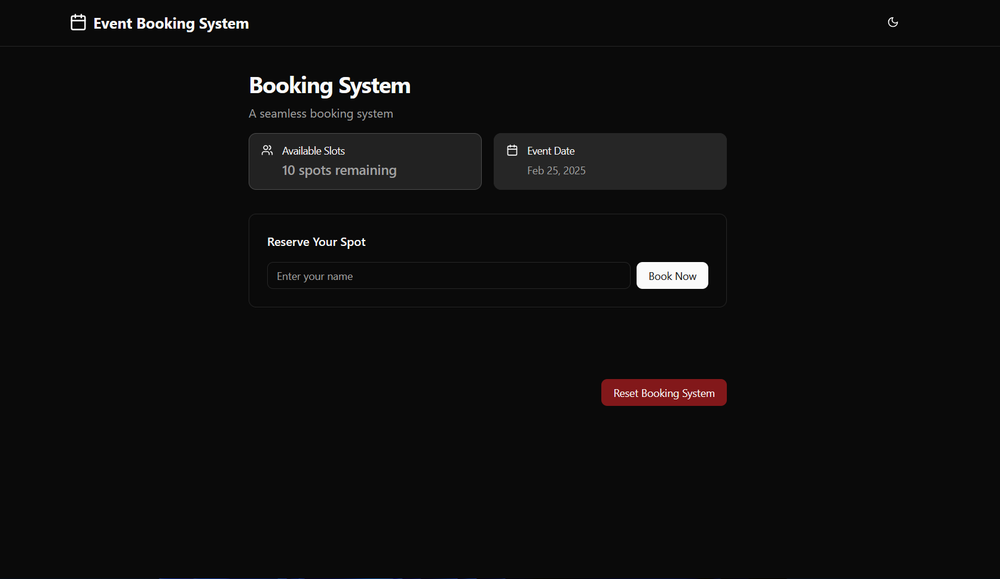

# Event Booking System (MERN - Frontend)
Live Demo: https://booking-application-sigma.vercel.app/



## Overview
This project is a React-based event booking system that allows users to book event slots, cancel bookings, and manage a waiting list. It utilizes **TypeScript**, **Tailwind CSS**, and **localStorage** for persistent state management.

## Features
- Display available slots for an event.
- Allow users to book available slots.
- Cancel bookings and update slot availability.
- Manage a waiting list when slots are full.
- Automatically allocate slots to users on the waiting list when a booking is canceled.
- Persistent state management using `localStorage`.
- Reset functionality to restore initial slot count.

## Setup Instructions

### Prerequisites
Ensure you have the following installed:
- **Node.js** (Latest LTS recommended)
- **npm** or **yarn**

### Installation
1. Clone the repository:

```
git clone https://github.com/harshit-070/booking-application
```

2. Navigate to the project directory:
```
cd booking-application
```
3. Install dependencies:
```
npm install 
```

### Running the Application
Start the development server:
The app will run on `http://localhost:5173/`.

## State Management Approach
- A **custom React hook** (or Context API) is used to manage booking state.
- Data is **persisted in `localStorage`**, ensuring state is maintained across page refreshes.
- The state includes:
  - Available slots
  - Confirmed bookings
  - Waiting list
- The waiting list is **automatically updated** when slots become available.

## Booking Flow
1. **Booking**
   - Clicking "Book Now" decreases available slots and adds a booking.
   - If no slots are available, users are given the option to join the waiting list.
2. **Cancellation**
   - Users can cancel their bookings, freeing up a slot.
   - If users are on the waiting list, the first in line is automatically booked.
3. **Reset**
   - A "Reset" button allows reinitialization of the system from environment variables.

## Error Handling
- Prevents overbooking when slots are full.
- Handles edge cases, ensuring a smooth user experience.


